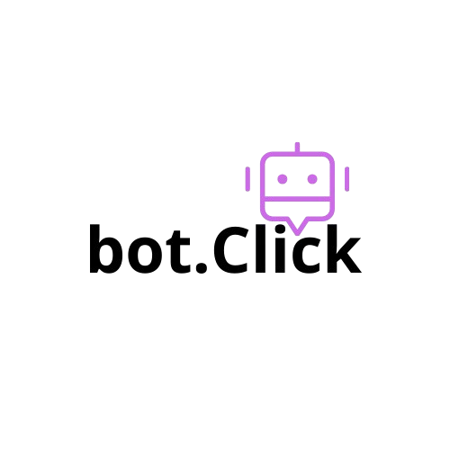

# 🖱️ **bot.Click - Mouse & Keyboard Recorder** 🎹  

  
*(Your ultimate productivity companion)*

---

## ✨ **Overview**  
**bot.Click** is a simple and intuitive **Windows application** built with **Python** 🐍. It allows you to:
- 🎥 **Record** your mouse and keyboard inputs.  
- 🔄 **Replay** recorded actions seamlessly.  
- 🚀 **Automate** repetitive tasks with ease.  

Whether you're looking to automate workflows or just experiment with input recording, **bot.Click** has got you covered!  

---

## 📥 **Download and Run**  

1. **Download the EXE**:  
   - Head over to the [📁 **dist** folder](dist/) and download the `dist` folder.  
   - No need for Python or any additional setup! It's a standalone executable.  

2. **Run the Application**:  
   - Simply double-click the `.exe` file to start using **bot.Click**!

---

## 🔧 **Features**  

- **Recording**:
  - Record your mouse movements, clicks, and keyboard inputs.
  - Start and stop recording with simple buttons or hotkeys.
  - Save your recordings for later use.

- **Playback**:
  - Replay your recorded actions with precision.
  - Adjust playback settings such as repeat count and delay.
  - Optional infinite playback for continuous action.

- **Keyboard Shortcuts**:
  - **F10**: Start/Stop recording.
  - **Ctrl + F2**: Start/Stop playback.

---

## ⚙️ **How to Use**  

1. **Recording**:
   - Click the **Start Recording** button or press **F10** to begin recording your mouse and keyboard actions.
   - Click **Stop Recording** to end the recording session.

2. **Playback**:
   - Click **Play Recording** or press **Ctrl + F2** to start playing back your recorded actions.
   - You can set the **repeat count** and **delay** to customize the playback.

3. **Import and Remove Files**:
   - Use the **Import Recording** button to load previously saved recordings.
   - If you want to remove a loaded recording, click the **Remove Imported File** button.

---

## 🛠️ **Dependencies**  

Ensure you have the following modules installed to run the program:
- `keyboard`
- `plyer`
- `pynput`
- `PyQt6`
- `schedule`
- `six`

---

## 💻 **Building the EXE**  

To compile the project into an `.exe` file using PyInstaller:

1. Install the necessary dependencies:
   ```bash
   pip install pyinstaller keyboard plyer pynput PyQt6 schedule six
   ```

2. Run the following PyInstaller command:
   ```bash
   pyinstaller --noconfirm --onefile --windowed --hidden-import=keyboard --hidden-import=plyer --hidden-import=pynput --hidden-import=PyQt6 --hidden-import=schedule --hidden-import=six --icon="assets/botclick.png" --add-data "assets;assets" main.py
   ```

3. The compiled executable will be located in the `dist/` folder.

---

## 📂 **Folder Structure**  

Here's an overview of the project folder structure:
```
bot-click/
│
├── assets/                   # Folder containing images (e.g., icons)
│   └── botclick.png           # Application icon
│
├── dist/                     # Compiled executable files
│   └── pgoc_mouse.exe         # Your final executable
│
├── main.py                   # Main Python script
├── README.md                 # This file
└── requirements.txt          # Python dependencies
```

---

## 💬 **Contact**  
For any feedback, feel free to reach out!  
You can contact me at: [john.leonard@example.com](mailto:john.leonard@example.com)

---

Happy automating! 🎉  
